# Authentication implemented using NEXT.js + Auth.js 

This is sample NEXT.JS application which uses [`Auth.js`](https://authjs.dev) to authenticate user (email + password) and issue session token

Auth.js is a runtime agnostic library based on standard Web APIs that integrates with multiple modern JavaScript frameworks to provide an authentication experience. see [`next-auth-example`](https://github.com/nextauthjs/next-auth-example)

- Backend NEXT.js implemented server side authentication using `Auth.js` `5.0.0-beta.4` and issue session token
- Frontend NEXT.js side + client pages
- MongoDB (recplica set) for store user accounts

> **Note**
> Application based on [Next.js Postgres Auth Starter](https://vercel.com/templates/next.js/prisma-postgres-auth-starter) with modified using `Prisma` and `MongoDB`

### Library components used

- [NEXT.js](https://nextjs.org/) framework, NEXT Router
- [Auth.js](https://authjs.dev) for authentication
- [Prisma ORM](https://www.prisma.io/docs/orm/overview/introduction/what-is-prisma) for dataase schema, access and operations
- [Zod](https://zod.dev/?id=introduction) for content validation according to defined schema
- [Bcrypt](https://github.com/kelektiv/node.bcrypt.js#readme) a library to help you hash passwords
- [React-hot-toast](https://react-hot-toast.com/docs) for notifications in client

## Create the development server

### 1. Installation modules

- install dependencies modules

```
npm install
```

### 2. Start up MongoDB and MongoExpress

- add DNS record of host.docker.internal to /etc/hosts

```
172.17.0.1 host.docker.internal
```

- start up MongDB docker image

```
docker-compose up -d
```

### 3. Update environment variables file - '/.env'

- Add database conncetion URL
- Generate one here: https://generate-secret.vercel.app/32 (only required for localhost)

```
DATABASE_URL="mongodb://host.docker.internal:27017/jwt?replicaSet=rs0&ssl=false"

AUTH_SECRET="64030d57a5c1cc75c5bc2fad994b7696"
AUTH_TRUST_HOST=http://localhost:3000
```

### 4. Generate prisma client and migration User schmea to MongoDB

- Generate prisma client (try to re-generate the cilent if updated schema and error occurred)
- Migrate the schema to MongoDB if there is any change to '/prisma/schema.prisma' file

```
npx prisma generate
npx prisma db push
```

### 5 Run in development mode

```
npm run dev
```

### 6 Run in production mode

```
npm run build
npm run start
```

## Testng 
- Acccess http://localhost:3000/

### Home Page
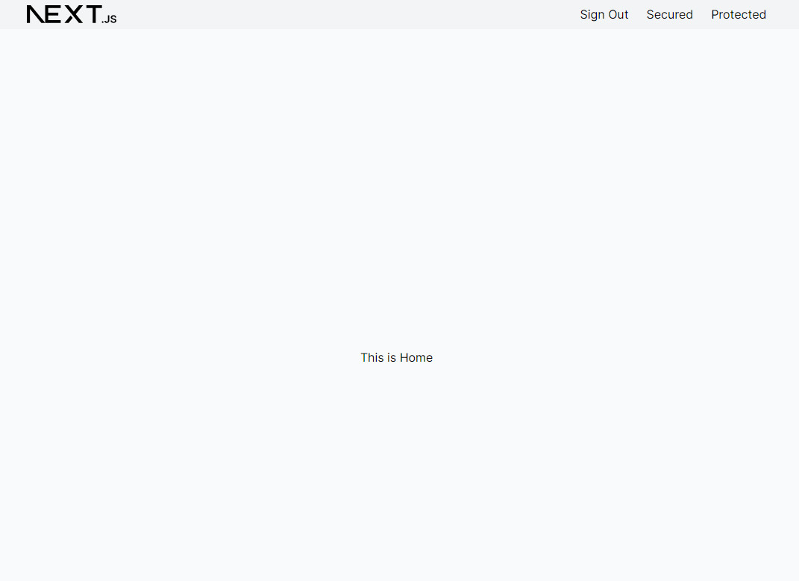
Cookie before sign in
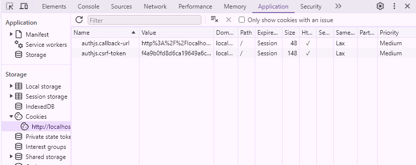
Menu bar before sign in
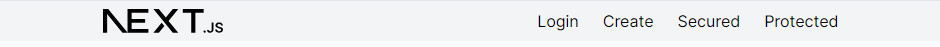

### Create User Page
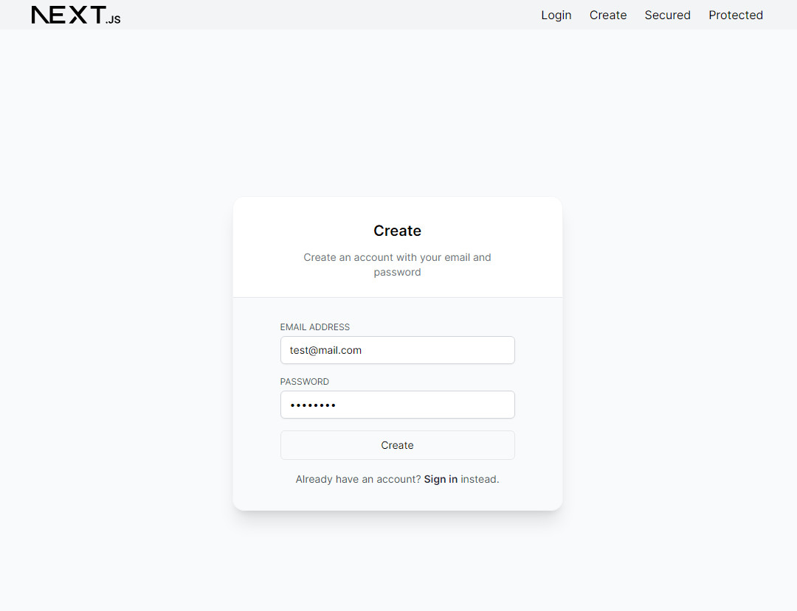
Account created and redirect to Sign in Page
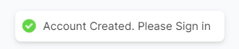
Account stored in MongoDB
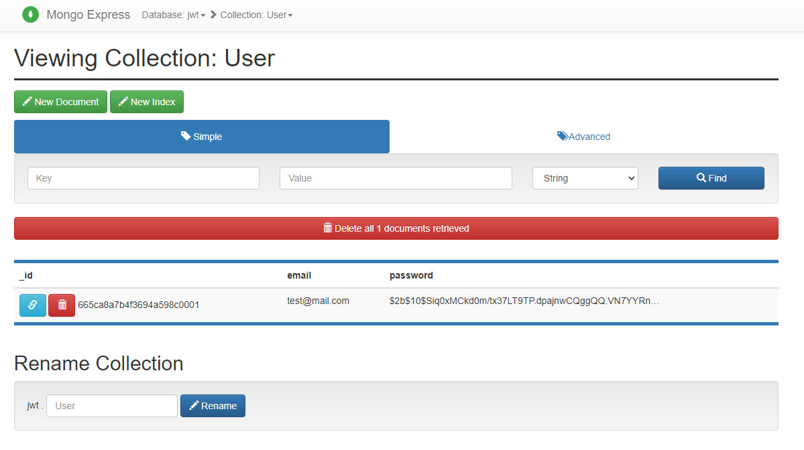
Account creation failed, for example duplicated user, data validation fail and etc!
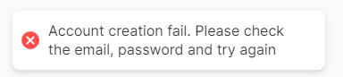
Creation validation fail, for example password too long/short, and etc!
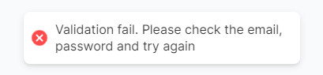

### Sign in User Page
- After sign in, if no callback url, it will redirected to Home Page
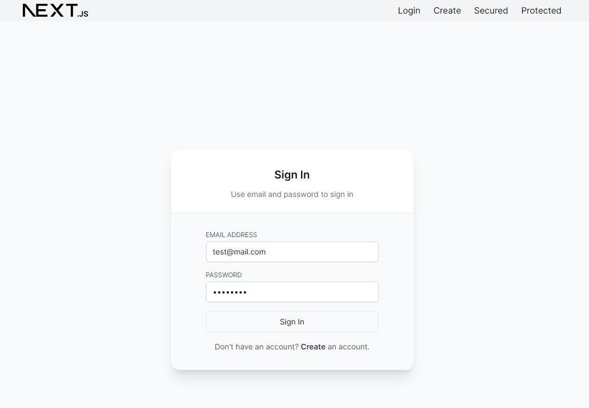
Client side input validation
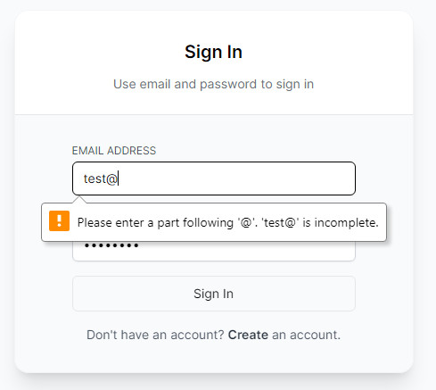
Account sign in failed, for example user not found, password not match, too long/short and etc! 
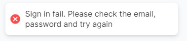
Cookie after sigin in
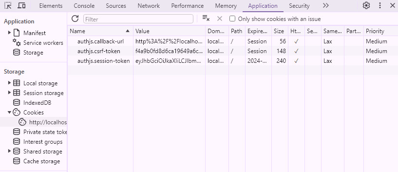
Menu bar after sign in
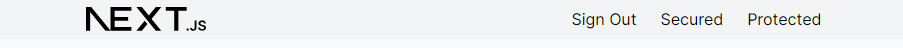

### Protected and Secure Page
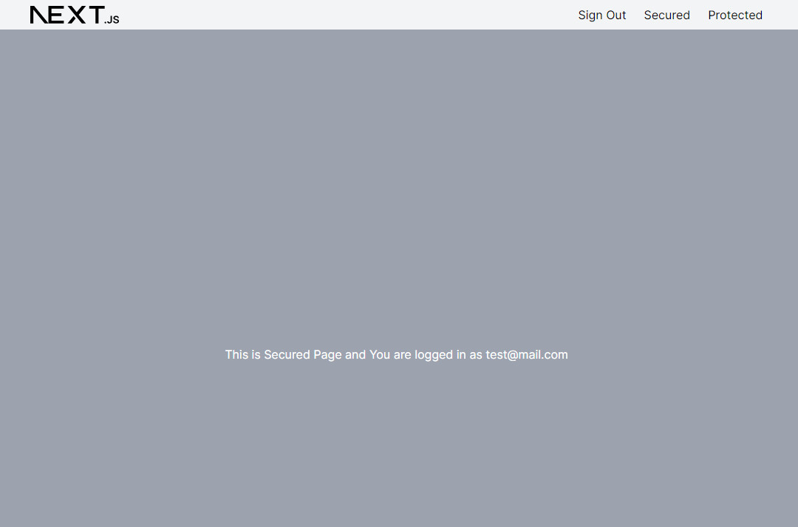
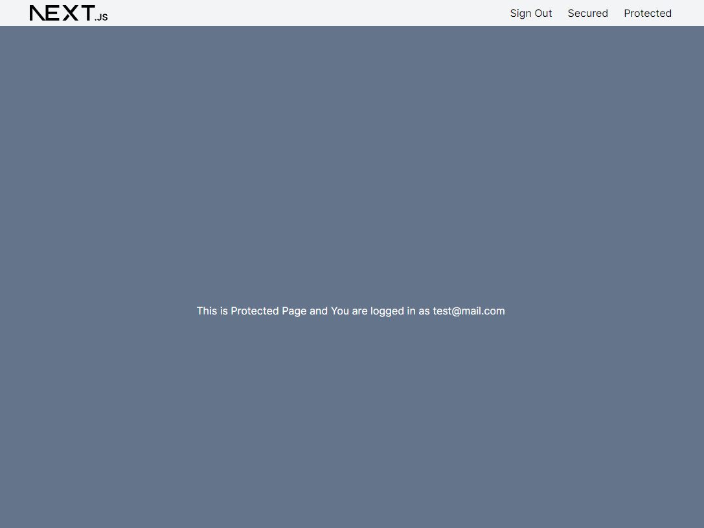

> **Note**
> Without sign in, these page will redirect to `Sign In'. It will redirected back after sucessful sign in
Callback URL added
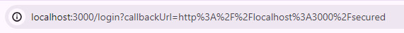


## Learn More

To learn more about Next.js and Auth.js, take a look at the following resources:

- [Next.js Documentation](https://nextjs.org/docs) - learn about Next.js features and API.
- [Learn Next.js](https://nextjs.org/learn) - an interactive Next.js tutorial.
- [`Auth.js`](https://authjs.dev/getting-started/installation?framework=next.js) - Getting Started for Next.JS

You can check out [the Next.js GitHub repository](https://github.com/vercel/next.js/


## Deploy on Vercel

The easiest way to deploy your Next.js app is to use the [Vercel Platform](https://vercel.com/new?utm_medium=default-template&filter=next.js&utm_source=create-next-app&utm_campaign=create-next-app-readme) from the creators of Next.js.

Check out our [Next.js deployment documentation](https://nextjs.org/docs/deployment) for more details.
