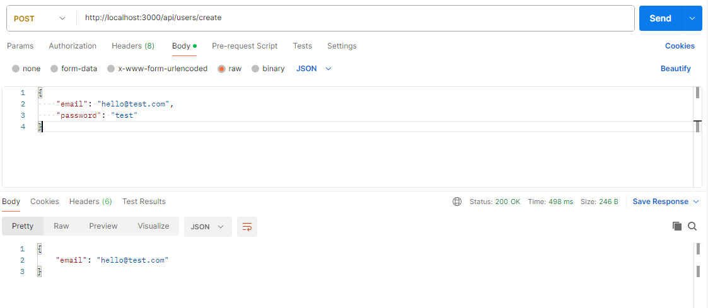

# JWT Authentication implemented using NEXT.js framework

This is sample NEXT.JS application which uses [`next/font`](https://nextjs.org/docs/basic-features/font-optimization) to automatically optimize and load Inter, a custom Google Font
- Backend NEXT.js implement NEXT Router as API server for authentication and issue JWT token
- Frontend NEXT.js using React (to be implemented)
- MongoDB (recplica set) for store user accounts. Password-hashing with Bcryp

### Library components used

- [NEXT.js](https://nextjs.org/) framework, NEXT Router
- [Prisma ORM](https://www.prisma.io/docs/orm/overview/introduction/what-is-prisma) for dataase schema, access and operations
- [Zod](https://zod.dev/?id=introduction) for content validation according to defined schema
- [Bcrypt](https://github.com/kelektiv/node.bcrypt.js#readme) a library to help you hash passwords
- [jsonwebtoken](https://jwt.io/introduction) JSON Web Token (JWT) implementation library

## Create the development server

### 1. Installation modules

- install dependencies modules

```
npm install
```

### 2. Start up MongoDB and MongoExpress

- add DNS record of host.docker.internal to /etc/hosts

```
172.17.0.1 host.docker.internal
```

- start up MongDB docker image

```
docker-compose up -d
```

### 3. Update environment variables file - '/.env'

- Add database conncetion URL and JWT secure key

```
DATABASE_URL="mongodb://host.docker.internal:27017/jwt?replicaSet=rs0&ssl=false"
JWT_KEY="This is secure key"
```

### 4. Generate prisma client and migration User schmea to MongoDB

- Generate prisma client (try to re-generate the cilent if updated schema and error occurred)
- Migrate the schema to MongoDB if there is any change to '/prisma/schema.prisma' file

```
npx prisma generate
npx prisma db push
```

### 5 Run in development mode

```
npm run dev
```

## Testng

### Use [Postman](https://www.postman.com/) to test API

- set 'Post' : 'localhost:3000/api/users/create'. Add body, click 'Beautify' and Send. Expect return user email created

```
body raw
    {
        "email": "hello@test.com",
        "password": "test"
    }
```



- set 'GET' : 'localhost:3000/api/users/auth'. Expect return user in database

- set 'Post' : 'localhost:3000/api/users/auth'. Add body, click 'Beautify' and Send. Expect return "token" OR "Authentication failed"

```
body raw
    {
        "email": "hello@test.com",
        "password": "test"
    }
```


> **Note**
> Use [jwt.io](http://jwt.io) to vertify the token validation
> The token signed 'userId: user.\_id' which '\_id' is the mongodb key.

## Learn More

To learn more about Next.js, take a look at the following resources:

- [Next.js Documentation](https://nextjs.org/docs) - learn about Next.js features and API.
- [Learn Next.js](https://nextjs.org/learn) - an interactive Next.js tutorial.

You can check out [the Next.js GitHub repository](https://github.com/vercel/next.js/) - your feedback and contributions are welcome!

## Deploy on Vercel

The easiest way to deploy your Next.js app is to use the [Vercel Platform](https://vercel.com/new?utm_medium=default-template&filter=next.js&utm_source=create-next-app&utm_campaign=create-next-app-readme) from the creators of Next.js.

Check out our [Next.js deployment documentation](https://nextjs.org/docs/deployment) for more details.
